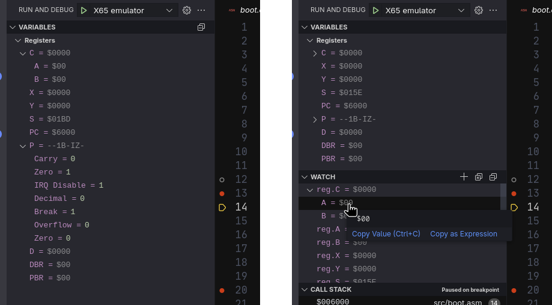

# cc65-dbg

This VS Code extension adds syntax and debugger support for cc65 and ca65.

## Features

Works with an adapter/emulator supporting Debug Adapter Protocol (DAP).

You need to provide your own debugger or debug adapter as `"command"` option,
which is able to communicate using DAP protocol over stdin/stdout or TCP socket.

The main job of this extension is to parse [debug info][1] file generated by
`ld65 --dbgfile` and use the information to drive the debugger executable.
It expects the file to be placed beside the `"program"` binary,
with `.dbg` extension.

The idea is that your debugger/adapter should not know about the format of the source
nor the assembler or compiler. It should just support breakpoints and interactive debugging.  
On the other side, the debugging extension for particular assembler/compiler should work
with many debuggers/emulators, supporting DAP protocol.

[1]: https://cc65.github.io/doc/ld65.html#s7

### Screenshots

Breakpoints synchronization between Emulator and VS Code:


CPU registers inspector and watch:



Module-scoped Globals view:


Disassembly view:


Memory view:


Arbitrary Watch expressions:


## Usage

To use the `cc65-dbg` extension for debugging your 6502/65816 binaries in VSCode,
configure your `.vscode/launch.json` file with one of the following templates:

### Launch a Debug Session

To start the emulator and begin debugging automatically:

```json
{
  "type": "cc65-dbg",
  "request": "launch",
  "name": "Debug file",
  "program": "hello_world.bin",
  "command": "/usr/local/bin/emu",
  "args": ["--dap"],
  "stopOnEntry": true,
  "cwd": "${workspaceFolder}",
  "trace": true
}
```

* `program`: The binary file to debug.
* `command`: Path to your emulator binary.
* `args`: Enter whatever arguments your emulator needs to enable DAP server.
* `stopOnEntry`: Set to `true` to halt at program start.
* `cwd`: Working directory.
* `trace`: Enables DAP message logging for troubleshooting.

### Attach to a Running Emulator

To attach the debugger to an emulator already running with DAP server port open:

```json
{
  "type": "cc65-dbg",
  "request": "attach",
  "name": "Attach running",
  "program": "hello_world.bin",
  "address": "ws://localhost:4567/debug/",
  "trace": true
}
```

* `program`: Binary used by the running emulator (for symbols).
* `address`: WebSocket DAP endpoint of the emulator.

### CMake Integration (Recommended for CMake Projects)

You can streamline your workflow by integrating with VSCode's CMake Tools extension:

```json
{
  "type": "cc65-dbg",
  "request": "launch",
  "name": "Build & Debug",
  "program": "${command:cmake.launchTargetPath}",
  "command": "/usr/local/bin/emu",
  "args": ["--dap", "${command:cmake.launchTargetPath}"],
  "stopOnEntry": true,
  "cwd": "${workspaceFolder}",
  "trace": true,
  "preLaunchTask": "CMake: build"
}
```

* Automatically uses the current CMake build target for `program`.
* Builds the project before launching via `preLaunchTask`.

## Requirements

> [!NOTE]
> Following is a deviation from Debug Adapter Protocol, used to simplify
> the DAP-debugger implementation for 8-bit machine emulators.

The extension will present the breakpoint memory addresses as `lines` property
of [SetBreakpoints Request][2]. Debugger does not need to know anything
about the source structure - this is the job of the extension. It just needs to be able to
set *memory breakpoints*, pause and step through the program execution.

[2]: https://microsoft.github.io/debug-adapter-protocol/specification#Requests_SetBreakpoints

Breakpoints are presented in packs identified with `sourceReference` number
(`0` included) of [Source][3] descriptor. Your debugger endpoint should track the
source reference number of a breakpoint in order to remove it, when an update
for the pack is being received.

[3]: https://microsoft.github.io/debug-adapter-protocol/specification#Types_Source

## Emulators

List of emulators supporting this variation of DAP:

* Emu  — The [X65 Computer](https://x65.zone/) Emulator.

If you know any other, please [create a PR][4] with an update to the list.

[4]: https://github.com/X65/cc65-dbg/pulls

## Acknowledgements

This extension builds on code from:

* [Alchemy65](https://github.com/AlchemicRaker/alchemy65)
* [db65xx](https://github.com/tmr4/db65xx)

Kudos to its authors!
